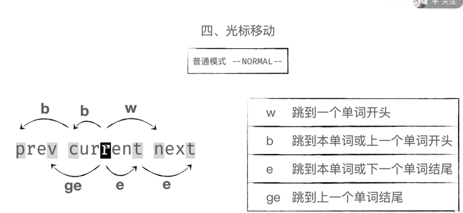
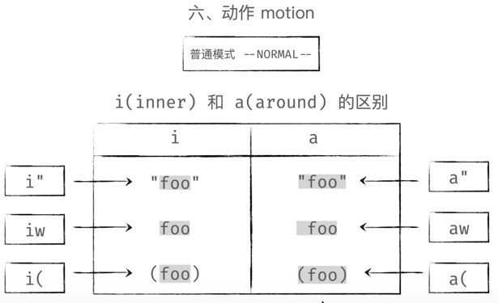
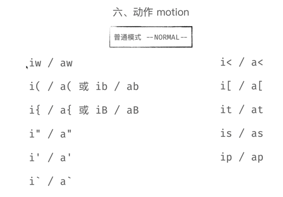

### 安装gin
安装gin相关模块：
```
go get -u github.com/gin-gonic/gin@v1.5.0
```
vim 快捷键 

动作


删除
d
复制粘贴 yy - p
撤销  u
if want change the word in ""
```
input "c i w" to change in the word between ""
input "d i w" to deleted in the word between ""
input "y i w" to copy in the word between ""
```
同一行操作
f+s 往后查找
F+v 向前查找
^ 光标移动到行首
$ 光标移动到行尾

d+i+e 删除整个文件内容
删除打断内容 d+i+t delete inner tail
修改内容 c+i+t 

### main 
> 定义了一个主方法，声明一个router，服务端口和读写时间
```go
func main() {
	router := routers.NewRouter()

	s := &http.Server{
		Addr:           ":8080",
		Handler:        router,
		ReadTimeout:    10 * time.Second,
		WriteTimeout:   10 * time.Second,
		MaxHeaderBytes: 1 << 20,
	}
	err := s.ListenAndServe()
	if err != nil {
		return 
	}
}
```
## 封装基础功能

### 统一错误编码

```go
package errcode

var (
	Success                   = NewError(0, "成功")
	ServerError               = NewError(10000000, "服务内部错误")
	InvalidParams             = NewError(10000001, "入参错误")
	NotFound                  = NewError(10000002, "找不到")
	UnauthorizedAuthNotExist  = NewError(10000003, "鉴权失败，找不到对应的Appkey和AppSecret")
	UnauthorizedTokenError    = NewError(10000004, "鉴权失败，token错误")
	UnauthorizedTokenTimeout  = NewError(10000005, "鉴权失败，token超时")
	UnauthorizedTokenGenerate = NewError(10000006, "鉴权失败，token生成失败")
	TooManyRequests           = NewError(10000007, "请求过多")
)
```


### 统一配置管理
安装 viper
`go get -u github.com/spf13/viper@v1.4.0`